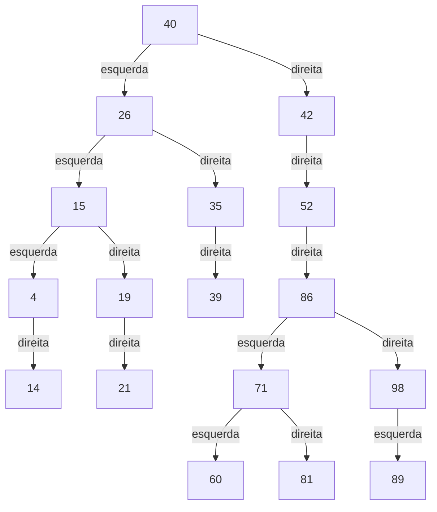

```mermaid
graph TD
    node0["40"]
    node1["26"]
    node2["15"]
    node3["4"]
    node4["14"]
    node3 -->|direita| node4
    node2 -->|esquerda| node3
    node5["19"]
    node6["21"]
    node5 -->|direita| node6
    node2 -->|direita| node5
    node1 -->|esquerda| node2
    node7["35"]
    node8["39"]
    node7 -->|direita| node8
    node1 -->|direita| node7
    node0 -->|esquerda| node1
    node9["42"]
    node10["52"]
    node11["86"]
    node12["71"]
    node13["60"]
    node12 -->|esquerda| node13
    node14["81"]
    node12 -->|direita| node14
    node11 -->|esquerda| node12
    node15["98"]
    node16["89"]
    node15 -->|esquerda| node16
    node11 -->|direita| node15
    node10 -->|direita| node11
    node9 -->|direita| node10
    node0 -->|direita| node9
```